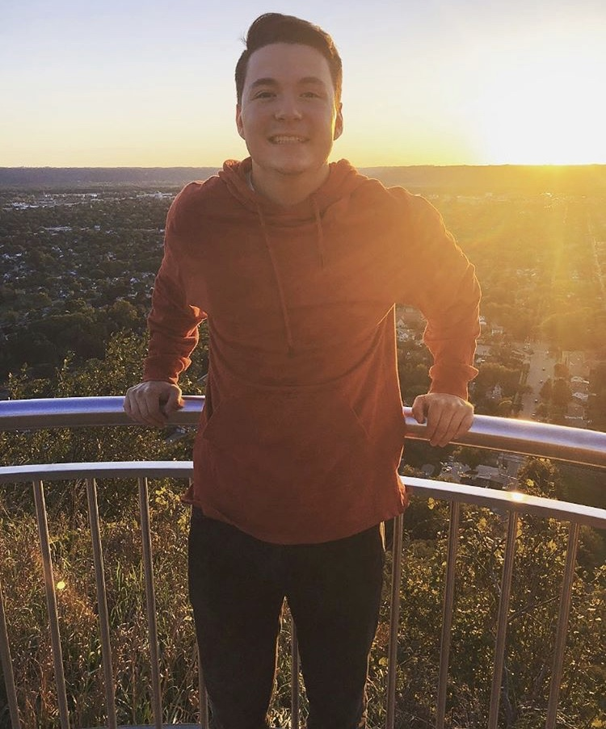

_Data Scientist based out of Milwaukee, Wisconsin_

[Email](mailto:ningaber@gmail.com) / [GitHub](https://github.com/GabeRombalski13) / [LinkedIn](https://www.linkedin.com/in/gabriel-rombalski-b50b4014a/) 

## Technical Experience

**Data Scientist** @ [Elutions](https://www.elutions.com/) _(June 2022 - Present)_  

_Description: Data scientist involved in the creation and continuous deployment of live models_

- Developed supervised and unsupervised models for several clients, including water treatment plants, heating and cooling systems, and chemical manufacturing plants.

- Deployed models into a live setting and built out several delopment packages, including a package to monitor model performance and data drift.

 

**Data Science Intern** @ [U.S. Geological Survey](https://www.usgs.gov/) _(June 2021 - June 2022)_ 

_Description: Applied multivariate statistics and machine learning on projects focused on natural resources and invasive or endangered species._  

 - Examined demographics of a sample of endangered Mussels with supervised and unsupervised techniques   
 
     * Non-Metric Multidimensional Scaling (NMDS), Principle Component Analysis (PCA), distance based Redundancy Analysis (db-RDA) in R 

 - Co-author of a paper examining relationship between selection of distance/dissimilarity metrics and performance of clustering, ordination, and canonical multivariate techniques   

     * Hierarchical Clustering, K-Means/Medoids, PCoA/PCA, NMDS and db-RDA in R on metabolomic datasets

 -  Statistical consulting and model implementation to quantify agreement statistics in aging technique used among invasive Silver Carp  

     - Linear Mixed Models in lme4 package in R
 
   
 
**Mathematical Tutor** at [University of Wisconsin La-Crosse](https:https://www.uwlax.edu/) _(September 2019 - Present)_ 
 - Mathematical knowledge of collegiate-level mathematics courses including Algebra, Calculus, and Linear Algebra.  
 
 - Advanced communication skills to ensure students' understanding

 
 

## Skills

**R**, **Microsoft Office**, **HTML5**, **Applied Statistics**, **Machine Learning**, **Exploratory Data Analysis**

 

## Education

**Bachelor of Science**  in Applied Mathematics and Analytics  
[Viterbo University](https://www.viterbo.edu/programs/engineering-and-applied-mathematics-and-analytics)  - La Crosse, Wisconsin  
Fall 2021 - Spring 2025 

 
 
 

## Personal Life

Born in Woodbury, Minnesota; grew up on the outskirts of Strum, Wisconsin. While not doing schoolwork, I enjoy disc golf, tennis, birdwatching, and photography. 

 

  
  
  

