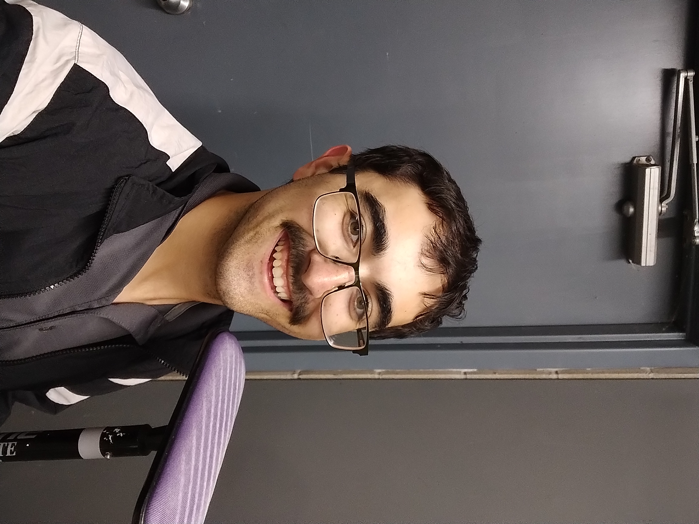

_Data Analytics student based out of La Crosse, Wisconsin_

[Email](mailto:ningaber@gmail.com) / [GitHub](https://github.com/GabeRombalski13) / [LinkedIn](https://www.linkedin.com/in/gabriel-rombalski-b50b4014a/) 

## Technical Experience

**Ecological Data Analyst Intern** @ [U.S. Geological Survey](https://www.usgs.gov/) _(August 2024 - December 2024)_ 

_Description: Learned about and applied occupancy models to invasive carp data collected from 6 pools along the Illinois River._  

 - Explored carp detection data and generated models using equipment types, sample dates, and location as factors.   

 - Created a poster board summarizing the internship that will be presented at Viterbo's Interns in Action event.   

 - Learned self-sufficiency; improved communication skills and demonstrated professionalism.  

 - Met twice per week with USGS site supervisor to coordinate strategies.
 
   
 
_**Waterfowl Radar Analysis & Detection**_ - Capstone Project at [Viterbo University](https:https://www.viterbo.edu/) _(August 2024 - Present)_ 
 - Academic research project fulfilling senior-year capstone requirement.  
 
 - Worked in collaboration with USGS Upper Midwest Environmental Science Center.  

 - Used radar scans to track local waterfowl migration (Pools 7 and 8 of the Mississippi River).  

 - Focused on data analytics, using R's bioRad package to generate visual summaries of radar data.  

 - Periodic field observations to corroborate radar data with actual waterfowl sightings.

 
 

## Skills

**R**, **Microsoft Office**, **HTML5**, **Applied Statistics**, **Exploratory Data Analysis**

 

## Education

**Bachelor of Science**  in Applied Mathematics and Analytics  
[Viterbo University](https://www.viterbo.edu/programs/engineering-and-applied-mathematics-and-analytics)  - La Crosse, Wisconsin  
Fall 2021 - Spring 2025 

 
 
 

## Personal Life

Born in Woodbury, Minnesota; grew up on the outskirts of Strum, Wisconsin. While not doing schoolwork, I enjoy disc golf, curling, tennis, birdwatching, and photography. 

 

  
  
  

